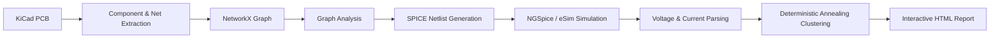

# PCB Linter using Deterministic Annealing Clustering

An intelligent **KiCad PCBNew plugin** that combines **graph analytics**, **SPICE simulation**, and **Deterministic Annealing Clustering** to automatically analyze PCB designs, identify electrical issues, and generate an interactive HTML report.

Developed during the **FOSSEE IIT Bombay eSim Summer Fellowship**.

---

## 🎥 Demo Video

https://drive.google.com/file/d/17kpoB3BqmgxSyOLpP3UkCkHnmOoAlYZf/view?usp=sharing

---

## ✨ Features

- Automatic PCB graph extraction
- NetworkX based graph analysis
- Automatic SPICE netlist generation
- NGSpice simulation integration
- eSim library support
- Voltage, Current and Power domain clustering
- Deterministic Annealing Clustering
- Floating net detection
- High fanout detection
- Single Point of Failure detection
- Automatic power rail detection
- Interactive HTML report generation
- Voltage heatmaps
- Interactive network visualization
- Cluster quality evaluation
- Net-to-component mapping

---

## 🏗️ Architecture



---

## ⚙️ Workflow

1. Open the PCB in KiCad.
2. Launch the PCB Linter plugin.
3. Extract components and electrical nets.
4. Generate a SPICE netlist.
5. Run NGSpice simulation.
6. Parse voltage and current data.
7. Perform graph analysis and clustering.
8. Generate an interactive HTML report.

---

## 📊 Technologies Used

- Python
- KiCad PCBNew API
- NetworkX
- NGSpice
- eSim
- PyVis
- Tkinter
- HTML/CSS
- JSON

---

## 📁 Repository Structure

```text
pcb_linter_da_clustering/
│── pcb_linter_action.py
│── pcb_linter_main.py
│── icon.png
│── README.md
```

---

## 📄 Output

The plugin automatically generates:

- Interactive HTML Report
- Network Graph Visualization
- Voltage Heatmap
- Voltage Domains
- Current Domains
- Power Domains
- Quality Score
- Findings Summary
- Net-to-Component Mapping

---

## 🚀 Future Improvements

- Machine Learning based anomaly detection
- Thermal analysis
- Signal integrity analysis
- EMI analysis
- ERC integration
- PDF report export

---

## 🤝 Acknowledgements

Developed as part of the **FOSSEE IIT Bombay eSim Summer Fellowship**.

Special thanks to:

- FOSSEE, IIT Bombay
- eSim Development Team
- KiCad Community
- NGSpice Developers
- NetworkX Developers

---

## 📜 License

This project is licensed under the MIT License.
