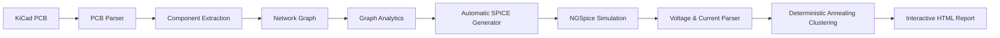
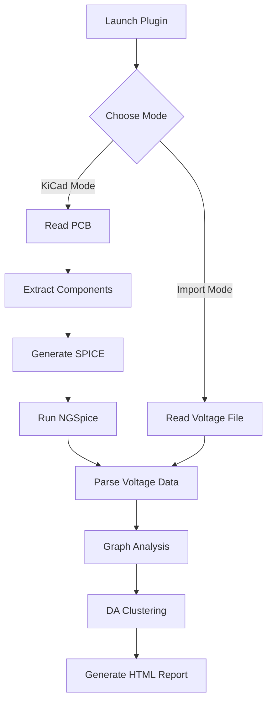
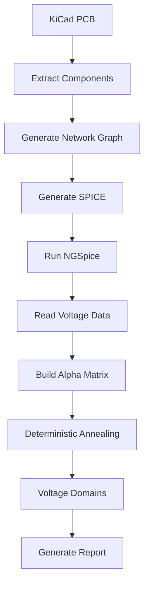
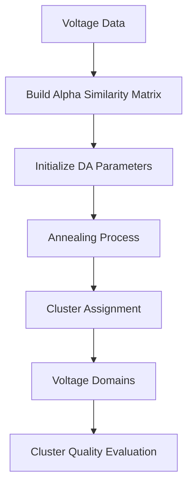
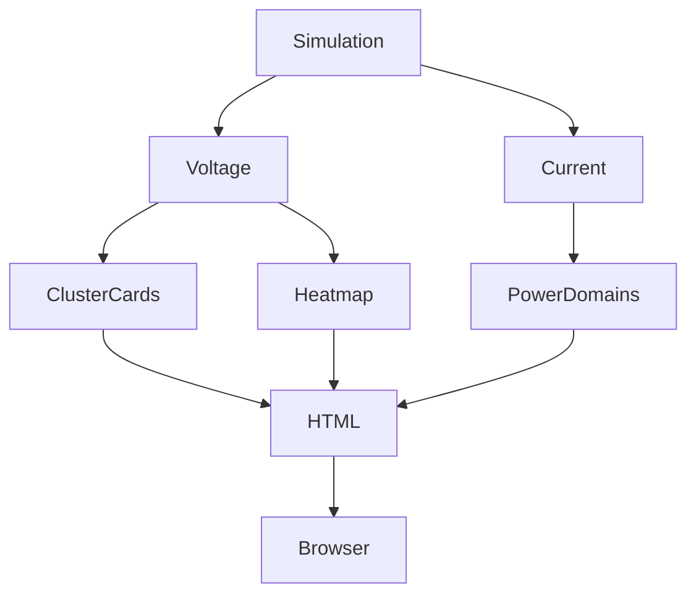

# PCB Linter using Deterministic Annealing Clustering

<p align="center">


</p>

<h3 align="center">
An Intelligent KiCad Plugin for Electrical Rule Analysis using Graph Analytics, SPICE Simulation, and Deterministic Annealing Clustering
</h3>

<p align="center">


</p>

<p align="center">

Built during the **FOSSEE IIT Bombay eSim Summer Fellowship**

</p>

---

# 📖 Overview

PCB Linter is an intelligent **KiCad PCBNew plugin** that automatically analyzes PCB designs beyond conventional Design Rule Checks (DRC).

Instead of only checking physical constraints such as track clearance or overlap, the plugin studies the **electrical behaviour** of the circuit by combining graph theory, SPICE simulation and Deterministic Annealing clustering.

The plugin automatically extracts the PCB connectivity graph, generates a SPICE netlist, performs NGSpice simulation, analyzes voltage/current domains and produces an interactive HTML report containing network visualizations, electrical findings and quality metrics.

---

# ✨ Highlights

- ⚡ Automatic SPICE Netlist Generation
- 🧠 Deterministic Annealing Clustering
- 📊 Interactive HTML Dashboard
- 🌐 Network Graph Visualization
- 📈 Voltage Heatmaps
- 🔍 Floating Net Detection
- ⚠ High Fanout Detection
- 🚨 Single Point of Failure Detection
- 🔋 Automatic Power Rail Identification
- 🧩 eSim Subcircuit Support
- 📉 Cluster Quality Metric
- 📄 Automatic Report Generation

---

# 🎥 Demo

https://drive.google.com/file/d/17kpoB3BqmgxSyOLpP3UkCkHnmOoAlYZf/view

---

# 🚀 Motivation

Modern PCB Design Rule Checkers verify manufacturing constraints but fail to answer questions like

- Which voltage domains exist?
- Which components are electrically critical?
- Are there floating signal nets?
- Which node becomes a Single Point of Failure?
- Is the circuit electrically balanced?
- Which regions consume maximum power?

PCB Linter was developed to answer these questions automatically inside KiCad.

---

# 🏗 System Architecture



---

# ⚙ Complete Workflow



---

# 🔬 Internal Processing Pipeline

```mermaid
flowchart LR

PCB

-->Parser

Parser

-->Graph

Graph

-->Simulation

Simulation

-->Voltage

Simulation

-->Current

Voltage

-->Voltage Domains

Current

-->Current Domains

Voltage Domains

-->Power Domains

Current Domains

-->Power Domains

Power Domains

-->Interactive Report
```

---

# 🌟 Core Features

## 📌 Graph Extraction

The PCB is transformed into a graph where

- Components become graph nodes.
- Electrical nets become graph edges.
- Complete connectivity information is preserved.

---

## 📈 Graph Analytics

The generated graph is analyzed using NetworkX.

Metrics include

- Degree Centrality
- Betweenness Centrality

This enables automatic detection of

- High Fanout Components
- Critical Electrical Nodes
- Single Points of Failure

---

## ⚡ Automatic SPICE Generation

The plugin converts the PCB directly into a SPICE circuit without requiring manual netlist creation.

Supported devices include

- Resistors
- Capacitors
- Inductors
- Voltage Sources
- Current Sources
- BJTs
- MOSFETs
- Diodes
- Operational Amplifiers
- Voltage Regulators
- eSim Subcircuits

---

## 🔋 Intelligent Power Rail Detection

Power rails are automatically detected from net names.

Examples include

- VCC
- VDD
- 3V3
- 5V
- 12V
- VBAT
- VBUS
- VEE
- VNEG

The plugin also allows user-defined voltage configuration.

---

## ⚠ Electrical Issue Detection

Automatically detects

- Floating Signal Nets
- Missing Voltage Sources
- High Fanout Components
- Single Point of Failure
- Improper Power Nets
- Unconnected Pins
- Simulation Failures

---

## 🧠 Deterministic Annealing Clustering

Instead of traditional K-Means clustering, PCB Linter employs Deterministic Annealing.

Benefits include

- Stable convergence
- Better voltage domain separation
- No random initialization
- Reduced local minima
- Improved clustering quality

---

## 🌐 Interactive HTML Dashboard

A complete HTML report is generated automatically containing

- Quality Score
- Voltage Domains
- Current Domains
- Power Domains
- Interactive Network Graph
- Voltage Heatmap
- Cluster Cards
- Findings Table
- Net-to-Component Mapping
- Simulation Summary

---

# 📊 Feature Summary

| Feature | Supported |
|----------|-----------|
| KiCad Integration | ✅ |
| eSim Integration | ✅ |
| NGSpice Simulation | ✅ |
| NetworkX Analytics | ✅ |
| Voltage Clustering | ✅ |
| Current Clustering | ✅ |
| Power Clustering | ✅ |
| HTML Dashboard | ✅ |
| Interactive Graph | ✅ |
| Voltage Heatmap | ✅ |
| Floating Net Detection | ✅ |
| High Fanout Detection | ✅ |
| SPOF Detection | ✅ |
| Cluster Quality Metric | ✅ |
| Automatic SPICE Generation | ✅ |
| Power Rail Detection | ✅ |

---

# 📚 Table of Contents

- Overview
- Features
- System Architecture
- Installation
- Project Structure
- Algorithms
- Usage
- Report Generation
- Future Work
- Acknowledgements
- License

---
````md
# 🛠 Installation

## Prerequisites

Before installing the plugin, ensure the following software is available on your system.

| Software | Version |
|-----------|----------|
| Python | 3.10+ |
| KiCad | 8.0+ |
| NGSpice | Latest |
| eSim | 2.5+ |

---

## Clone Repository

```bash
git clone https://github.com/prishabhatia46/eSim-KiCad-Plugin.git
```

Move into the plugin directory.

```bash
cd eSim-KiCad-Plugin/pcb_linter_da_clustering
```

---

## Install Dependencies

```bash
pip install networkx pyvis
```

---

## Enable Plugin

Copy the plugin folder into KiCad's Action Plugin directory.

Restart KiCad.

Open

```
Tools → External Plugins
```

or click the toolbar icon.

---

# 📂 Project Structure

```text
pcb_linter_da_clustering
│
├── pcb_linter_action.py
├── pcb_linter_main.py
├── icon.png
│
├── pcb_linter/
│
├── html/
│
├── reports/
│
├── assets/
│
└── README.md
```

---

# ⚙ Plugin Modes

PCB Linter supports two execution modes.

---

## 1️⃣ KiCad Mode

The plugin directly analyzes the currently opened PCB.

Workflow

```text
PCB

↓

Extract Components

↓

Generate SPICE

↓

Run NGSpice

↓

Voltage Analysis

↓

DA Clustering

↓

Interactive Report
```

---

## 2️⃣ Import Mode

Instead of simulating a PCB, existing voltage/current files can be imported.

Useful for

- Existing simulations
- External SPICE tools
- Academic datasets

---

# 🔄 Processing Workflow



---

# 📊 Graph Analysis

The plugin converts every PCB into a NetworkX graph.

Each

- Component → Node
- Net → Edge

Example

```text
R1 ------- C1

 \

  U1

 /

R2 ------- C2
```

The graph is analyzed to identify

- Critical components
- Bottlenecks
- Electrical hubs
- Connectivity

---

# 📈 Degree Centrality

Degree Centrality measures how many electrical connections each component has.

Components with unusually high degree often indicate

- Power distribution hubs
- Shared buses
- High fanout

Formula

```text
Degree(node)

--------------------

Maximum Possible Degree
```

---

# 🚨 Betweenness Centrality

Measures how frequently a component lies on the shortest electrical paths.

Higher values indicate

- Critical routing
- Potential bottlenecks
- Single Point of Failure

---

# 🔍 Floating Net Detection

Every net connected to only one component is automatically inspected.

The plugin distinguishes between

- Intentional connector pins
- Actual floating signal nets

Only genuine floating signals are reported.

---

# 🔋 Power Rail Detection

Power rails are inferred automatically from common naming conventions.

Supported examples

```text
VCC

VDD

3V3

5V

12V

VBUS

VIN

VBAT

VEE

VNEG
```

Custom voltages can also be assigned using the Power Rail Configuration dialog.

---

# ⚡ Automatic SPICE Generation

The PCB is translated into a SPICE-compatible circuit.

Supported components include

| Component | Supported |
|-----------|-----------|
| Resistor | ✅ |
| Capacitor | ✅ |
| Inductor | ✅ |
| Voltage Source | ✅ |
| Current Source | ✅ |
| BJT | ✅ |
| MOSFET | ✅ |
| Diode | ✅ |
| Op-Amp | ✅ |
| Voltage Regulator | ✅ |
| eSim Subcircuits | ✅ |

---

# 🧩 eSim Integration

Whenever supported components are detected,

PCB Linter automatically imports the corresponding eSim library models.

Examples

- LM741
- LM358
- LM7805
- LM317
- LM555
- LM393
- LM386

If no compatible model exists, intelligent fallback models are used whenever possible.

---

# 💻 Technologies Used

| Category | Technologies |
|-----------|--------------|
| Language | Python |
| PCB API | KiCad PCBNew API |
| Simulation | NGSpice |
| Circuit Libraries | eSim |
| Graph Analytics | NetworkX |
| Visualization | PyVis |
| GUI | Tkinter |
| Reports | HTML + CSS |
| Data Storage | JSON |

---

# 📦 Output Files

Running the plugin automatically generates

```text
pcb_linter_report.html

pcb_graph.html

plot_data_v.txt

plot_data_i.txt

pcblinter_sim.cir

pcb_voltages.json
```

These files are stored inside the plugin output directory.

---
````
# 🧠 Deterministic Annealing Clustering

Unlike traditional clustering algorithms that rely on random initialization, PCB Linter employs **Deterministic Annealing (DA)** to discover electrically meaningful voltage domains.

The algorithm gradually minimizes the system's free energy, allowing clusters to evolve smoothly before converging to stable voltage domains.

Advantages include

- Stable convergence
- No random initialization
- Reduced local minima
- Better voltage domain separation
- Consistent clustering across simulations

---

## Clustering Pipeline



---

# 📐 Alpha Similarity Matrix

Electrical similarity between nodes is computed using their simulated voltages.

Nodes with similar electrical behaviour obtain higher similarity scores, enabling meaningful voltage domain formation.


---

# 📊 Voltage Clustering

Nodes with similar voltage values are automatically grouped into electrical domains.

Example

| Cluster | Domain |
|----------|--------|
| Cluster 1 | Ground |
| Cluster 2 | 3.3V Logic |
| Cluster 3 | 5V Supply |
| Cluster 4 | 12V Rail |

---

# ⚡ Current Clustering

Current measurements obtained from NGSpice are independently clustered.

This enables

- Current path analysis
- Load distribution
- Current bottleneck identification

---

# 🔋 Power Clustering

Power consumption is computed using

```
Power = Voltage × Current
```

Power domains help identify

- High power regions
- Sensitive analog blocks
- Heavy current paths

---

# 📈 Cluster Quality Metric

PCB Linter automatically evaluates clustering quality by comparing

- Intra-cluster similarity
- Inter-cluster separation

The final score is categorized as

| Score | Rating |
|---------|---------|
| 90–100 | Excellent |
| 75–89 | Good |
| 50–74 | Fair |
| Below 50 | Poor |

---

# 📑 HTML Report

After analysis, an interactive HTML dashboard is generated automatically.

The report contains

- Overall Quality Score
- Simulation Summary
- Voltage Domains
- Current Domains
- Power Domains
- Voltage Heatmap
- Interactive Network Graph
- Cluster Cards
- Findings Table
- Net-to-Component Mapping

---

# 📊 Report Generation Pipeline



---

# 🌐 Interactive Network Visualization

The generated graph allows users to

- Inspect electrical connectivity
- Explore component relationships
- Identify critical nodes
- Visualize power rails
- Understand circuit topology

---

# 🔥 Voltage Heatmap

Every voltage node is color coded according to its electrical domain.

| Voltage | Domain |
|-----------|----------|
| 0V | Ground |
| 1.8V | Logic |
| 3.3V | Digital |
| 5V | Supply |
| 12V | High Voltage |
| Negative | Negative Rail |

---

# ⚠ Findings

PCB Linter automatically reports

✅ Floating Nets

✅ High Fanout Components

✅ Single Point of Failure

✅ Missing Voltage Sources

✅ Improper Power Rails

✅ Unconnected Pins

✅ Simulation Errors

---

# 📈 Quality Score

Every analyzed PCB receives an overall electrical quality score.

The score considers

- Graph topology
- Electrical findings
- Floating nets
- Critical nodes
- Clustering quality

Higher scores indicate healthier PCB designs.

---

# 🎯 Typical Workflow

```mermaid
flowchart LR

Design PCB

-->

Run Plugin

-->

Simulation

-->

Graph Analysis

-->

DA Clustering

-->

HTML Report

-->

Fix Issues

-->

Re-run Analysis
```

---

# 📷 Results

The plugin produces

- Interactive HTML Dashboard
- Voltage Heatmap
- Network Visualization
- Cluster Cards
- Findings Summary
- Quality Score
- Simulation Report

> Screenshots and report previews will be added soon.

---
# 🚀 Future Improvements

PCB Linter is designed to serve as a foundation for intelligent PCB analysis. Several enhancements are planned for future releases.

## Planned Features

- Machine Learning based anomaly detection
- Automatic ERC integration
- Thermal hotspot analysis
- EMI/EMC estimation
- Signal Integrity analysis
- Differential pair verification
- PCB Routing Quality Score
- Decoupling capacitor recommendations
- Power integrity analysis
- Automatic design optimization suggestions
- Export reports as PDF
- Multi-board comparison
- Cloud-based report generation

---

# 🏆 Achievements

PCB Linter combines multiple domains into a single workflow.

- PCB Design
- Graph Theory
- Network Science
- SPICE Simulation
- Data Analysis
- Interactive Visualization
- Electrical Rule Checking

Instead of treating these as independent tasks, PCB Linter automates the complete analysis pipeline inside KiCad.

---

# 📊 Project Statistics

| Metric | Description |
|----------|-------------|
| Language | Python |
| Framework | KiCad PCBNew API |
| Graph Library | NetworkX |
| Visualization | PyVis |
| Simulation Engine | NGSpice |
| Circuit Library | eSim |
| Report Engine | HTML + CSS |
| Configuration | JSON |

---

# 🎯 Applications

PCB Linter can be used for

- PCB Design Validation
- Academic Research
- Hardware Design Education
- Electrical Network Analysis
- Power Domain Inspection
- Circuit Debugging
- Rapid Prototyping
- eSim based Simulation
- Hardware Verification

---

# 🤝 Contributing

Contributions are welcome.

If you would like to improve PCB Linter

1. Fork the repository

2. Create a new branch

```bash
git checkout -b feature-name
```

3. Commit your changes

```bash
git commit -m "Add feature"
```

4. Push the branch

```bash
git push origin feature-name
```

5. Open a Pull Request

---

# 📜 License

This project is released under the MIT License.

Feel free to use, modify and distribute it while retaining proper attribution.

---

# 👩‍💻 Author

**Prisha Bhatia**

Python Developer

FOSSEE IIT Bombay – eSim Summer Fellow

GitHub

https://github.com/prishabhatia46

LinkedIn

https://linkedin.com/in/prishabhatia46

---

# 🙏 Acknowledgements

This work was developed during the **FOSSEE IIT Bombay eSim Summer Fellowship**.

Special thanks to

- FOSSEE, IIT Bombay
- eSim Development Team
- KiCad Community
- NGSpice Developers
- NetworkX Contributors
- PyVis Developers
- Open Source Community

---

# 📚 References

1. KiCad PCBNew API Documentation

2. NGSpice User Manual

3. eSim Documentation

4. NetworkX Documentation

5. PyVis Documentation

6. Deterministic Annealing Clustering

7. Clustering of Power Networks, IIT Bombay

---

# ⭐ Support

If you found this project useful,

⭐ Star the repository

🍴 Fork the repository

🛠 Contribute to the project

📢 Share it with others

---

<p align="center">

Made with ❤️ using Python, KiCad, NetworkX and NGSpice.

</p>
