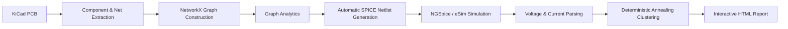

# PCB Linter using Deterministic Annealing Clustering

An intelligent **KiCad PCBNew plugin** for automated electrical rule analysis using **Graph Analytics**, **NGSpice Simulation**, and **Deterministic Annealing Clustering**.

> **Developed by Prisha Bhatia** as part of the **FOSSEE IIT Bombay eSim Semester Internship**.

---

## 🎥 Demo Video

https://drive.google.com/file/d/17kpoB3UkCkHnmOoAlYZf/view?usp=sharing

---

## 🚀 Overview

PCB Linter extends the capabilities of traditional Design Rule Checks (DRC) by analyzing the **electrical behavior** of PCB designs instead of only physical constraints.

The plugin automatically extracts the PCB connectivity graph, generates a SPICE netlist, performs circuit simulation using **NGSpice**, applies **Deterministic Annealing Clustering** to identify electrical domains, and generates an interactive HTML report for visualization and debugging.

---

## ✨ Features

- 🔍 Automatic PCB graph extraction
- 📊 NetworkX-based graph analysis
- ⚡ Automatic SPICE netlist generation
- 🧩 eSim library support
- 🖥️ NGSpice simulation integration
- 🧠 Deterministic Annealing voltage clustering
- 🔋 Voltage, Current and Power domain analysis
- ⚠️ Floating net detection
- 📈 High fanout detection
- 🚨 Single Point of Failure (SPOF) detection
- 🔌 Automatic power rail identification
- 🌐 Interactive network visualization
- 📄 Interactive HTML report generation
- 📊 Voltage heatmaps
- 📝 Net-to-component mapping
- ⭐ PCB quality score

---

## 🏗️ Architecture



---

## ⚙️ Workflow

1. Open the PCB in **KiCad**.
2. Launch the **PCB Linter** plugin.
3. Extract components and electrical nets.
4. Automatically generate a SPICE netlist.
5. Run NGSpice simulation.
6. Parse voltage and current values.
7. Perform graph analysis and clustering.
8. Generate an interactive HTML report.

---

## 📊 Technologies Used

| Category | Technology |
|----------|------------|
| Language | Python |
| PCB Framework | KiCad PCBNew API |
| Simulation | NGSpice |
| Circuit Library | eSim |
| Graph Analysis | NetworkX |
| Visualization | PyVis |
| GUI | Tkinter |
| Reports | HTML, CSS |
| Configuration | JSON |

---

## 📂 Repository Structure

```text
pcb_linter_da_clustering/
│── pcb_linter_action.py
│── pcb_linter_main.py
│── icon.png
│── README.md
```

---

## 📄 Generated Output

Running the plugin automatically generates:

- Interactive HTML Report
- Interactive Network Graph
- Voltage Heatmap
- Voltage Domains
- Current Domains
- Power Domains
- Cluster Cards
- Findings Summary
- Net-to-Component Mapping
- PCB Quality Score

---

## 🎯 Applications

PCB Linter can be used for:

- PCB Design Validation
- Electrical Rule Analysis
- Circuit Debugging
- Academic Research
- Hardware Education
- eSim-based Circuit Simulation
- Power Domain Analysis

---

## 🚀 Future Improvements

- Machine Learning based anomaly detection
- Thermal hotspot analysis
- EMI/EMC analysis
- Signal integrity checks
- Automatic ERC integration
- PDF report export
- Routing quality analysis

---

## 🤝 Acknowledgements

This project was developed during the **FOSSEE IIT Bombay eSim Semester Long Internship**.

Special thanks to:

- FOSSEE, IIT Bombay
- eSim Development Team
- KiCad Community
- NGSpice Developers
- NetworkX Developers


